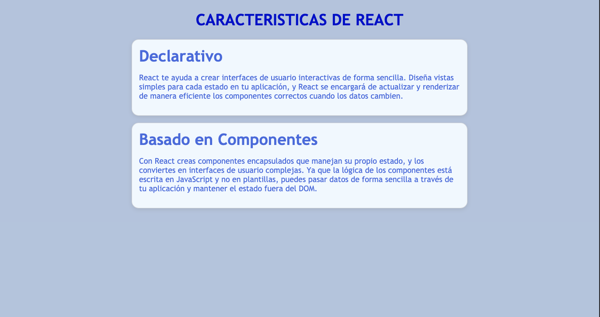

# Introducción a React

## ¿Cómo correr este proyecto?

- Copia este repositorio en tu carpeta de trabajo local 

```
git clone https://github.com/ejemplo-repositorio.git
```


2. Desvincúlalo del repositorio origen ejecutando el comando de git:

```bash
git remove rm origin
```
3. Con el boton derecho sobre el archivo index.html, elije la opción `open with Live Server` para que index.html se abra en tu navegador y puedas ver los cambios que realizas. 




# Objetivo:

Basandote en las caracteristicas de React que se describen en la [documentacion](https://es.reactjs.org/) oficial, y en el codigo ya existente en el proyecto, crea un tercer artículo que describa una tercera característica de React.

Te animas a implementar algunas mejoras en el codigo? Que cosas podriamos hacer para hacer mas interesante nuestro blog?
